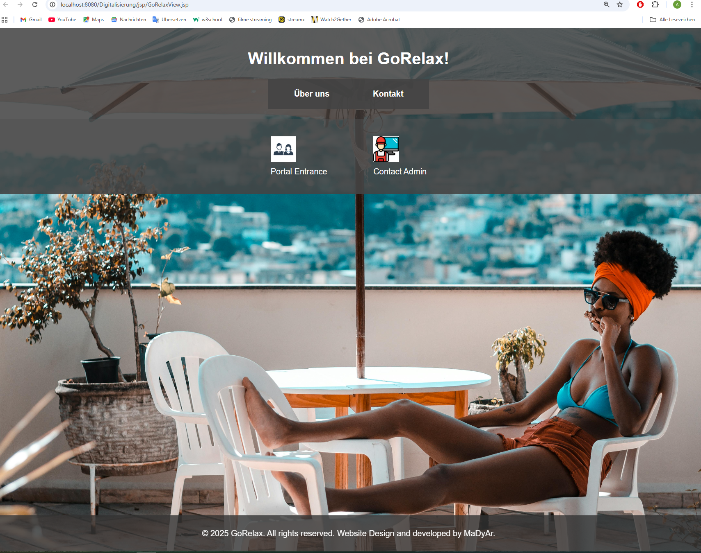
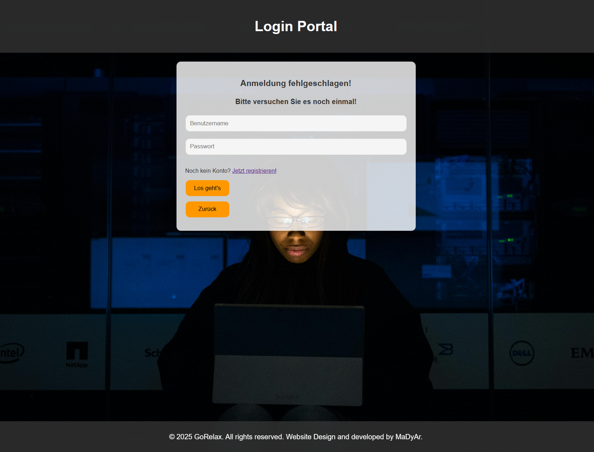
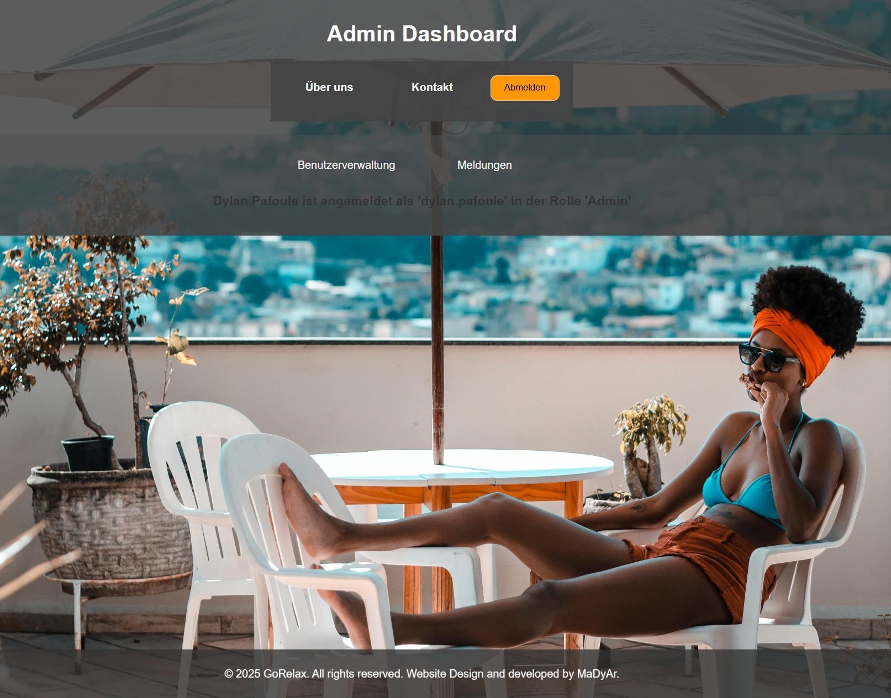

# GoRelax-Web-App

A web-based HR application built to digitize and streamline the process of submitting and managing leave requests and sick day reports.

Built as a university group project at **HWG Ludwigshafen** — Wirtschaftsinformatik B.Sc.  
**My role:** Frontend development — JSP views, CSS styling, JavaScript validation.

---

## Screenshots

### Home Page


### Login Portal


### Employee Portal


### Leave Request Form


### Sick Day Form


### Manager Dashboard


### HR Dashboard


### Admin Dashboard



### Database Schema


---

## About the Project

Many companies still manage leave requests and sick day reports manually or on paper — leading to inefficient workflows and high administrative overhead.

**GoRelax** solves this by providing a fully digital, role-based web portal where:
- Employees submit leave requests and sick day reports online
- Managers approve or reject requests in real time
- HR manages sick day reports and personnel overviews
- Admins manage user accounts and handle incoming messages

---

## Features

- **Role-based access** — 4 user roles with separate dashboards
  - Employee, Manager, HR Manager, Admin
- **Leave request management** — submit, approve, reject with automatic vacation day calculation
- **Sick day management** — submit with optional medical certificate upload
- **Status tracking** — real-time status updates (Open / In Progress / Approved / Rejected)
- **User management** — activate, deactivate, delete accounts
- **Contact form** — users can send messages directly to the Admin
- **Form validation** — client-side JavaScript validation on all forms
- **Automatic overlap detection** — prevents duplicate approved leave periods

---

## Tech Stack

| Layer | Technology |
|---|---|
| Architecture | MVC (Model-View-Controller) |
| Backend | Java (JavaBeans, JDBC) |
| Frontend | JSP, HTML, CSS, JavaScript |
| Database | PostgreSQL |
| Server | Apache Tomcat |
| IDE | Eclipse IDE for Enterprise Java |
| DB Tool | pgAdmin 4 |

---

## Database Structure

4 tables with relational design:

- **mitarbeiter** — employee data (PK: Personalnummer)
- **urlaubsantrag** — leave requests (FK: Personalnummer)
- **krankmeldung** — sick day reports (FK: Personalnummer)
- **meldungadmin** — contact messages to admin

---

## My Contributions

- Built all JSP view pages (Login, Registration, Employee Portal, Leave Request, Sick Day, Status Overview)
- Designed and implemented `GoRelax.css` — full layout, navigation, forms, tables, hover effects, fixed footer
- Implemented client-side JavaScript validation in `GoHello.js` — form field checks, password length, error messages
- Implemented tooltip functionality in `Hello.js`

---

## Project Structure

```
GoRelax/
├── src/main/java/
│   ├── de.hwg_lu.bwi520.beans/       → JavaBeans (business logic)
│   │   ├── AdminBean.java
│   │   ├── AntragsBean.java
│   │   ├── GoRelaxBean.java
│   │   ├── KrankmeldungBean.java
│   │   ├── LoginBean.java
│   │   └── UrlaubBean.java
│   ├── de.hwg_lu.bwi520.jdbc/        → Database connection
│   └── de.hwg_lu.bwi520.keineBeans/  → Model classes
├── src/main/webapp/
│   ├── css/
│   │   └── GoRelax.css               → Main stylesheet
│   ├── js/
│   │   ├── Hello.js                  → Tooltip logic
│   │   └── GoHello.js                → Form validation
│   └── jsp/                          → All view pages
│       ├── LoginView.jsp
│       ├── RegistrierungView.jsp
│       ├── MitarbeiterView.jsp
│       ├── LeiterView.jsp
│       ├── HRView.jsp
│       ├── AdminView.jsp
│       └── ...
└── README.md
```

---

## How to Run

This project requires a local setup with Eclipse, Apache Tomcat and PostgreSQL.

1. Clone the repository
2. Open in **Eclipse IDE for Enterprise Java Developers**
3. Add **PostgreSQL JDBC driver** to the build path
4. Configure **Apache Tomcat** as the server runtime
5. Set up a **PostgreSQL** database and update connection details in `PostgreSQLAccess.java`
6. Run the project on the Tomcat server
7. Open `http://localhost:8080/GoRelax`

---

## Team

Built by a team of 3 — Wirtschaftsinformatik B.Sc., HWG Ludwigshafen (SoSe 2025)

- Gesalide Ariane Sime Tapondjou — Frontend (Views, CSS, JavaScript)
- Dylan Pafoule — Backend
- Marina Raissa Kamani Tchamaha — Backend

Supervisor: Prof. Dr. Haio Röckle

---

## Links

- 🔗 [LinkedIn](https://linkedin.com/in/ariane-sime-9022632b3/)
- 💻 [GitHub](https://github.com/ArianeSame)
